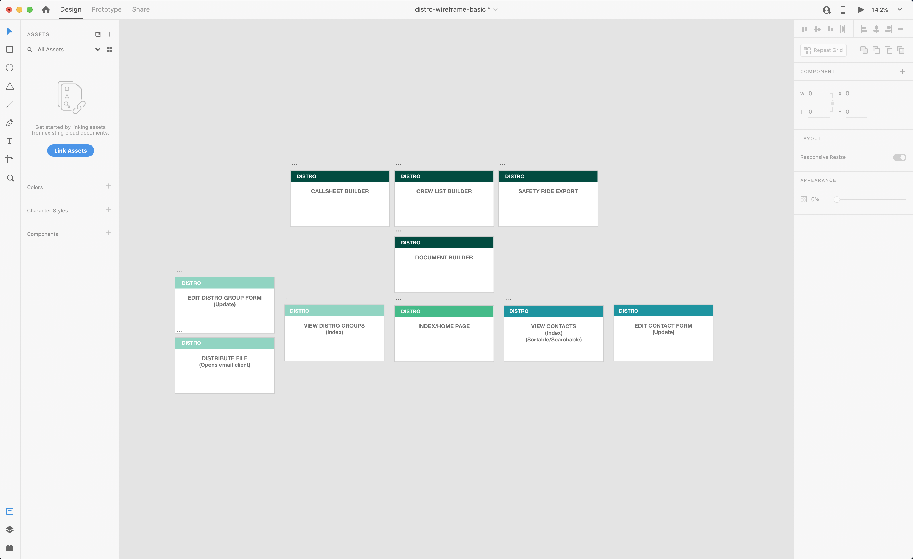

# dISTRO

##### dISTRIBUTION can be difficult.
</br>

Do you and your boss have a different idea of what 'send it wide' means?  

Are you tired of accidentally sending nudity riders to day-playing grips?  

Does the 2nd AD want you to add YET ANOTHER PA to the call sheet distro?

With dISTRO, creating and managing distribution lists is simple, visual, and secure. Once a user enters a crew member's information, that data can then be used to populate confidential and non-confidential distribution lists, call sheets, crew lists, and many other essential production documents.

---
### dEPENDENCIES:
- jsPDF http://mrrio.github.io/jsPDF/ // https://jspdf.readthedocs.io/en/latest/#creating-your-first-document


###### Contacts Schema (this kinda thing)
```js
{
  name: String,
  department: String,
  position: String,
  keyOrHead: Boolean,
  email: String,
  phone: String,
  emergencyContactName: String,
  emergencyContactNumber: String,
  BTL('Below the Line'): Boolean,
  coreCrew: Boolean,
  uberPermissions: Boolean,
}
```

###### Distribution List Schema (something like this)
```js
{
  title: String,
  confidential: Boolean,
  recipients: [subcollection'????']
}
```
---

### dELIVERABLES
MVP Functionality:
- Create, Read, Update and Delete Show Contacts
- CRUD Distribution lists (made of contacts)
- Populate email client with addresses from distribution list

Stretch Functionality:
- Call Sheet Generator (jsPDF)
- Crew List Generator (jsPDF)
- UBER Safety Rides CSV Generator (JSON to CSV SUPER STRETCH)
---

### dAY BREAKDOWN
| DAY | TASK |
|-|-|
| WED | FULL CRUD SINGLE MODEL (CONTACTS) && LEARN SUBDOCUMENTS [STRETCH: EMAIL CONTACT FUNCTIONALITY] |
| THU | FULL CRUD TWO MODELS (CONTACTS AND DISTRO LISTS) && EMAIL FUNCTIONALITY  [STRETCH: START AUTH?] |
| FRI | AUTHENTICATION && STYLING [STRETCH: LEARN JSPDF] |
| SAT | JSPDF && EXTRA FEATURES (MORE MODELS, MORE POPULATED DOCS, UX DESIGN) |
| SUN | STYLING AND UX/UI |
| MON | BUFFER DAY |

---

### dISPLAY

