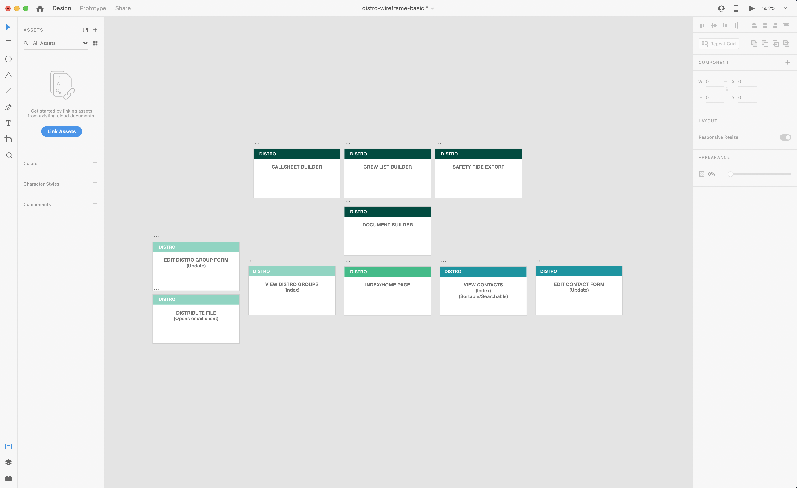

# dISTRO

##### dISTRIBUTION can be difficult.
</br>

Do you and your boss have a different idea of what 'send it wide' means?  

Are you tired of accidentally sending nudity riders to day-playing grips?  

Does the 2nd AD want you to add YET ANOTHER PA to the call sheet distro?

With dISTRO, creating and managing distribution lists is simple, visual, and secure. Once a user enters a crew member's information, that data can then be used to populate confidential and non-confidential distribution lists, call sheets, crew lists, and many other essential production documents.

---
### dEPENDENCIES:
- jsPDF http://mrrio.github.io/jsPDF/ // https://jspdf.readthedocs.io/en/latest/#creating-your-first-document


###### Contacts Schema (this kinda thing)
```js
{
  name: String,
  department: String,
  position: String,
  keyOrHead: Boolean,
  email: String,
  phone: String,
  emergencyContactName: String,
  emergencyContactNumber: String,
  BTL('Below the Line'): Boolean,
  coreCrew: Boolean,
  uberPermissions: Boolean,
}
```

###### Distribution List Schema (something like this)
```js
{
  title: String,
  confidential: Boolean,
  recipients: [subcollection'????']
}
```
---

### dELIVERABLES
MVP Functionality:
- Create, Read, Update and Delete Show Contacts
- CRUD Distribution lists (made of contacts)
- Populate email client with addresses from distribution list

Stretch Functionality:
- Call Sheet Generator (jsPDF)
- Crew List Generator (jsPDF)
- UBER Safety Rides CSV Generator (JSON to CSV SUPER STRETCH)
---

### dAY BREAKDOWN
| DAY | TASK |
|-|-|
| WED | FULL CRUD SINGLE MODEL (CONTACTS) && LEARN SUBDOCUMENTS [STRETCH: EMAIL CONTACT FUNCTIONALITY] |
| THU | FULL CRUD TWO MODELS (CONTACTS AND DISTRO LISTS) && EMAIL FUNCTIONALITY  [STRETCH: START AUTH?] |
| FRI | AUTHENTICATION && STYLING [STRETCH: LEARN JSPDF] |
| SAT | JSPDF && EXTRA FEATURES (MORE MODELS, MORE POPULATED DOCS, UX DESIGN) |
| SUN | STYLING AND UX/UI |
| MON | BUFFER DAY |

---

### dISPLAY



EXTRAS:
distro - app for emailing things out with less anxiety

- asks you if you're sure before sending out the email / populating the emailing
- lets you review the members of the distro group
- identifies members with certain tags to ask for extra confirmation

- build contacts database
- link distro list database? Can this be done with one model?
- create email population user experience (are you sure's, btl/atl confirmation, certain people in certain color font)
- figure out authentication
- focus on new user onboarding
- search functionality?


for now, the basic structure should go:
log in
click a button to create a new contact
click a button to see all contacts
click a button to edit a contact
click a button to begin a new email to a distro group
click a button to build a new distro group
click a button to edit a distro group

can i get away with not using a second model? what if i just have tags and you can add tags
and those tags are the distro groups. you could then just pull from those objects and when you wanna email the call sheet distro, you just do a find all query of all documents that have that tag as 'true' and then return the email addresses/ whatever information you want


So I have a few ways of populating the system:
the user can add a contact one at a time
user can create multiple contacts at once based on a single tag + name


TODO::
<!-- 1. Show Page Edit/Delete Buttons -->
<!-- 2. Edit Page Styling to be the same as Show Page -->
<!-- 3. New Page styling to be the same as Show Page -->
<!-- 1. Fix Distros on Show Page -->
<!-- 2. Index Page Styling -->
<!-- 4. Add 'Click Me' to Splash Page -->
1. Distro/Print Page Styling
2. Edit Page Add/Delete Distros Logic
3. Write Up README
